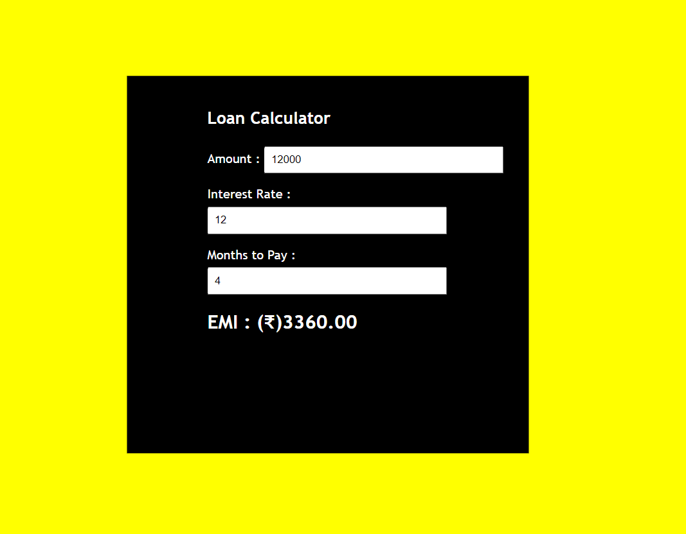

# Web Page for Mathematical Calculations

## AIM:

To design a static website with validation to perform mathematical calculations in client side.

## DESIGN STEPS:

### Step 1:

Requirement collection.

### Step 2:

Creating the layout using HTML and CSS.

### Step 3:

Write javascript to perform the calculations.

### Step 4:

Include regularexpression based input validation.

### Step 5:

Validate the layout in various browsers.

### Step 6:

Validate the HTML code.

### Step 6:

Publish the website in the given URL.

## PROGRAM :
~~~ html
<!DOCTYPE html>
<html lang="en">
  
<head>
    <title>Loan Calculator</title>
  
    
</head>
  
<body>
    

        <h1>Loan Calculator</h1>
  
        
Amount  :
            <input id="amount" type="number" 
            onchange="Calculate()">
        

  
        
Interest Rate  :
            <input id="rate" type="number" 
            onchange="Calculate()">
        

  
        
Months to Pay :
            <input id="months" type="number" 
            onchange="Calculate()">
        

  
        <h2 id="total"></h2>
    

  

</body>
  
</html>
~~~ 
## OUTPUT:

## Result:

Thus a website is designed to perform mathematical calculations in the client side.
